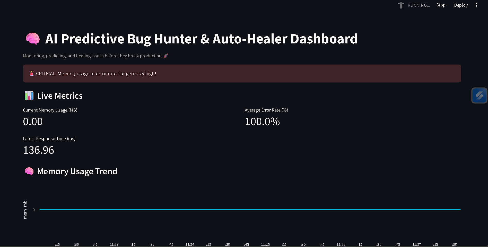
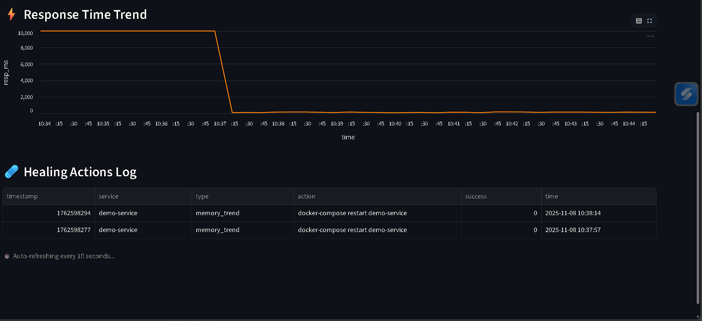

# AI Predictive Bug Hunter & Auto-Healer

This project is an AI-based system that monitors real APIs, predicts when an issue is likely to happen, and fixes it automatically before it causes any failure.  
It’s designed to behave like an automated reliability engineer that never stops watching your system.

---

# AI Predictive Bug Hunter & Auto-Healer

A system that monitors live APIs, predicts failures, and heals them automatically.





## What It Does

- Monitors live APIs (currently using GitHub’s API for testing)
- Learns what normal behavior looks like based on metrics like response time and error rate
- Predicts slowdowns or failures before they impact users
- Automatically takes corrective actions, such as restarting the monitor or switching to a backup API
- Displays everything on a live dashboard, including system health, metrics, and healing logs

---

## System Overview

Monitor Agent → Predictor Agent → Healer Agent → Dashboard


### Monitor Agent  
Continuously collects API performance data such as response time, error rate, and status code.

### Predictor Agent  
Analyzes recent metrics to identify patterns that suggest something might go wrong soon.

### Healer Agent  
Responds automatically:
- Switches to a backup API if the main one fails
- Restarts the monitoring process if latency increases or data becomes unstable
- Logs all actions and incidents in a local SQLite database

### Dashboard  
Built using Streamlit, the dashboard visualizes real-time metrics, system warnings, and healing activity.

---

## Tech Stack

- Python 3.10+
- FastAPI (for the healer service)
- Streamlit (for visualization)
- aiohttp + asyncio (for asynchronous monitoring)
- SQLite + NumPy (for data storage and analysis)

---

## How To Run It Locally

```bash
git clone https://github.com/YOUR_USERNAME/predictive-bughunter.git
cd predictive-bughunter

# create and activate virtual environment
python -m venv venv
venv\Scripts\activate   # on Windows

# install dependencies
pip install -r requirements.txt


Run each component in separate terminals

# Terminal 1 - Monitor Agent
python -m agents.monitor_agent

# Terminal 2 - Predictor Agent
python -m agents.predictor_agent

# Terminal 3 - Healer Agent
uvicorn agents.healer_agent:app --port 9002 --reload

# Terminal 4 - Dashboard
streamlit run dashboard/streamlit_app.py

Once everything is running, the system will start tracking the API, predicting potential issues, and applying automatic fixes.

How I Tested It

Since public APIs like GitHub rarely fail, I simulated real-world failures by:

Disconnecting the internet to simulate network downtime

Using invalid endpoints to trigger API errors

Adding artificial delays to simulate slow response times

The predictor successfully detected each scenario, and the healer reacted by switching to backups or restarting services. The dashboard reflected all these actions in real time.


Why I Built This

I wanted to explore how AI can be used in system reliability — not just to react to failures but to prevent them.
This project helped me understand how monitoring, anomaly detection, and automated recovery come together in real DevOps systems.
It’s my attempt to create a system that doesn’t just report problems, but actually learns and fixes them on its own.